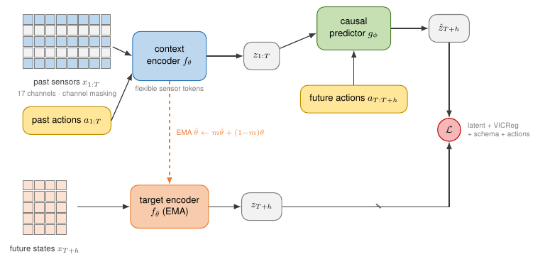
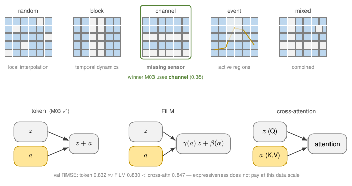

# SAAC-JEPA

**Schema-Adaptive Action-Conditioned JEPA for cross-machine CNC transfer under partial sensor overlap.**

A from-scratch PyTorch world model trained on one CNC machine (17 sensors) whose locked checkpoint was evaluated once on a second machine that shares only 10 of them, under a leakage-audited protocol.

<p align="center">
  
  <a href="https://ostertagmatthieu-dev.github.io/saac-jepa/"></a>
  <a href="https://ostertagmatthieu-dev.github.io/saac-jepa/paper.pdf"></a>
  <a href="https://github.com/ostertagmatthieu-dev/saac-jepa/actions/workflows/ci.yml"></a>
  
  <a href="LICENSE"></a>
</p>

<p align="center">
  <br>
  <sub>Figure 1. Dashed green RevIN blocks mark the post-lock variant (paper App. H), not the locked model.</sub>
</p>

## What is this

- **Problem.** A CNC world model trained on one machine has to keep working on another whose sensing interface is not the one it was trained on. Source: THWS Spinner U5-620, 17 canonical channels, 62 NC-program sessions at 1 Hz. Target: the FH JOANNEUM repository, 7 independent runs, 10 of those channels.
- **Method.** An action-conditioned JEPA with a flexible sensor encoder: value, presence and schema indicators let one model accept any subset of a known sensor vocabulary. Context `K = 32 s`, direct prediction at `{1, 2, 4, 8, 16} s`, actions are spindle speed and the commanded X/Y/Z feeds.
- **Protocol.** Group-disjoint session splits, train-only normalizers, leakage audits, deterministic validation masks, a 20-candidate architecture search scored on source validation alone, a lock that was refused once for instability, a SHA-256 lock, and a single sealed pass on the target machine.
- **Framing.** An audited transfer case study, not a SOTA claim. Official RevIN-equipped PatchTST and iTransformer still win on raw zero-shot RMSE, and a post-lock ablation shows why.

## Results at a glance

| Model | Source RMSE | Target zero-shot RMSE | Target NLL | Note |
|---|---|---|---|---|
| Persistence | 1.135 | 0.654 | — | trivial floor; source = validation split (1.128 on the source test split) |
| PatchTST (official, RevIN) | 0.804 | 0.503 | — | deterministic, single run; source = test split |
| iTransformer (official, RevIN) | 0.822 | 0.498 | — | deterministic, single run; source = test split |
| **SAAC-JEPA (locked, M03)** | **0.822 ± 0.009** (7 seeds) | **0.546** | 0.52 | single sealed pass; R² 0.012; source = validation mean |
| **SAAC-JEPA + RevIN (post-lock)** | **0.766 ± 0.001 (3 seeds)** | **0.495 ± 0.004 (3 seeds)** | 20.6 | second declared read; calibration collapses |

<sub>RMSE in z units of the source-train normalizer, lower is better. Target = the 10 shared JOANNEUM channels over 7 runs, 2,457 windows. <b>The source column is not like-for-like</b>: the official baselines are scored on the source test split (5,189 windows, 17 sensors), the SAAC-JEPA rows are source-validation means over seeds. Pre-lock few-shot curve: 0.612 / 0.611 / 0.540 / 0.520 at 0 / 5 / 10 / 20 % target support. DS03 has been read exactly twice — the sealed locked pass and the declared post-lock ablation. Full definitions, per-horizon R², calibration and the RevIN ablation: <a href="docs/results.md">docs/results.md</a>.</sub>

## Method in five lines

```
history sensors + past actions   -> flexible sensor encoder -> temporal context latent
future actions + context latent  -> causal JEPA predictor   -> future latent sequence
future states                    -> EMA target encoder      -> target latent sequence
[RevIN variant, App. H] context-window (c, s) -> normalise both windows -> same pipeline -> de-normalise the physical head
```

Training combines latent prediction against a stop-gradient EMA target, optional per-horizon VICReg, physical probabilistic forecasting (mean and log-variance), action recovery and schema consistency.

Missing or absent sensors carry separate value, presence and schema indicators, so a target machine exposing 10 of the 17 known sensors needs no re-dimensioning and no new input layer. The audit, the selection score and the lock are described in [docs/protocol.md](docs/protocol.md).

<details>
<summary>Masking modes and action injection</summary>

<p align="center"></p>

</details>

## Quickstart

With [uv](https://docs.astral.sh/uv/) — this is what `make setup` does for you:

```bash
git clone https://github.com/ostertagmatthieu-dev/saac-jepa.git && cd saac-jepa
uv venv --python 3.12 && source .venv/bin/activate
uv pip install --index-url https://download.pytorch.org/whl/cpu "torch>=2.3"
uv pip install -e ".[dev]"
```

With pip, after the same clone:

```bash
python -m venv .venv && source .venv/bin/activate
pip install -r requirements.txt && pip install -e ".[dev]"
```

Then, either way:

```bash
make smoke    # synthetic data -> validate -> pretrain -> fine-tune -> evaluate on CPU
              # prints SMOKE_CORE_OK, a few minutes, no download needed
make test     # the pytest suite
```

<details>
<summary>GPU note</summary>

Skip the CPU index line and install the CUDA build of PyTorch appropriate to your machine, then `uv pip install -e ".[dev]"`. On a DGX, use the installed CUDA/PyTorch stack if it is newer and compatible.

</details>

## Reproduce the paper

1. Download both datasets and lay them out as [docs/data.md](docs/data.md) describes.
2. Ingest and audit:
   ```bash
   python scripts/60_ingest_real_data.py --config configs/real.yaml
   ```
3. Run the pipeline:
   ```bash
   python scripts/61_run_all_spark.py --config configs/real.yaml --dry-run
   python scripts/61_run_all_spark.py --config configs/real.yaml
   ```

Phases run in order:

```
p2_audits -> p3_core -> p3fix_gate -> p4_ablations -> p5_baselines -> p6_evals -> p7_search -> p8_adapt -> p10_revin -> p9_reports
```

`p2_audits` and `p3fix_gate` are gates: a failure inside either aborts the whole run. The full set took about six GPU-days on one NVIDIA DGX Spark (a single GB10 GPU). Phase table, flags, log locations and every per-command recipe: [docs/reproduce.md](docs/reproduce.md).

## Repository map

```
src/cncjepa/
  models/jepa.py       FlexibleSensorEncoder, ActionConditionedPredictor,
                       ActionConditionedJEPA, SchemaAdaptiveJEPA
  models/revin.py      MaskedRevIN — presence-aware instance normalization (post-lock)
  models/baselines.py  12 forecasters incl. RSSM, PatchTST-like, iTransformer-like; MODEL_REGISTRY
  pipeline.py prepare(), loaders_from_ds()   trainers.py training loops   planner.py cem_plan()
  checkpoint.py audited load, body-only / full state   data.py  masking.py  normalization.py
  losses.py  metrics.py  corruptions.py  adaptation.py  ssl_baselines.py
scripts/               73 files: 00..68 plus _common.py, _search_common.py, _ssl_common.py,
                       _val_bundle.py. Run from the repository root -> docs/scripts.md
configs/               base.yaml placeholder template · smoke.yaml tiny CPU config ·
                       real.yaml DS01/DS03 incl. the etl: section · search_v2/ the paper's 20
                       candidates M00..M19 with M03 locked · revin/ the post-lock arm ·
                       random_methods/ abandoned V1 sample, kept but unused by the paper
tests/                 protocol invariants, smoke, version
examples/              make_synthetic_ds01_ds03.py
third_party/           pinned official baseline repos (gitignored clones) + cnc_adapter/
paper/                 figures/ (TikZ sources, PDF and PNG), results/revin_ablation/
docs/                  the project page served by GitHub Pages, the Markdown docs, internal/
```

## Documentation

| Page | Contents |
|---|---|
| [docs/protocol.md](docs/protocol.md) | Splits, normalizers, leakage audits, the P3-FIX gate, the selection score, the lock, and what the evidence does not show |
| [docs/data.md](docs/data.md) | Both datasets, on-disk layout, the ETL and its audits, unit corrections, channel names, the synthetic path |
| [docs/reproduce.md](docs/reproduce.md) | Hardware, environment, the phase table, flags, logs, every per-command recipe |
| [docs/scripts.md](docs/scripts.md) | Catalogue of all 73 scripts with purposes and main flags |
| [docs/results.md](docs/results.md) | Full result tables, per-horizon R², few-shot curve, calibration, the post-lock RevIN ablation |
| [docs/internal/README.md](docs/internal/README.md) | Historical working documents, kept for auditability |
| [docs/UPDATING.md](docs/UPDATING.md) | How to update the project page, and where every headline number lives |
| [CONTRIBUTING.md](CONTRIBUTING.md) | Setup, the rules inherited from the protocol, pull-request expectations |
| [CHANGELOG.md](CHANGELOG.md) | Release history |

## Citation

```bibtex
@article{bouaziz2026saacjepa,
  title   = {Schema-Adaptive Action-Conditioned JEPA for Cross-Machine CNC
             Transfer under Partial Sensor Overlap},
  author  = {Bouaziz, Ayoub Louaye and Ostertag, Matthieu
             and Demasles, Anton},
  journal = {arXiv preprint},
  year    = {2026},
  eprint  = {ARXIV-ID},
  archivePrefix = {arXiv},
  primaryClass  = {cs.LG},
  note    = {arXiv identifier to be added after announcement},
  url     = {https://ostertagmatthieu-dev.github.io/saac-jepa/}
}
```

Or use GitHub's "Cite this repository" button, which reads [CITATION.cff](CITATION.cff).

## Limitations

The results cover one source machine and one target machine with seven independent runs: they establish cross-machine transfer for this pair under partial sensor overlap, and nothing broader. No amount of architecture search fixes that — more machines or an external dataset would. The locked target number is a single checkpoint evaluated once; the three-seed control arm of the post-lock ablation gives 0.555 ± 0.015 on the same windows, which is the spread to keep in mind around it. On the source machine, plain supervised baselines are ahead as well (RSSM 0.759 and MLP 0.771 on source validation against 0.822). The model does not beat the official RevIN-equipped forecasters on raw zero-shot RMSE, and the post-lock ablation attributes that gap to normalization rather than architecture — at the cost of target calibration, which collapses. Per horizon the locked model explains variance only at 1–4 s and falls below the pooled target-mean predictor at 8 and 16 s. Several diagnostics were measured before the lock and have not been re-measured on the locked model: the few-shot curve, the action-shuffle sensitivity (which moved target RMSE by less than 0.005), and interval coverage (67 % empirical at a nominal 90 %). Baselines and ablations are single-seed at repository defaults unless a seed count is stated. The paper makes no SOTA claim.

## Acknowledgments

This work was made possible by compute provided by Atos IT Services UK Limited. Every experiment reported here ran on hardware they made available; without it the project would not have been feasible.

## Data and license

- THWS five-axis CNC milling dataset (source, DS01): [10.5281/zenodo.14094887](https://doi.org/10.5281/zenodo.14094887), CC BY 4.0.
- FH JOANNEUM CNC machining repository (target, DS03): [10.17632/gtvvwmz7r7.2](https://doi.org/10.17632/gtvvwmz7r7.2), CC BY 4.0.
- Official baseline repositories are pinned to specific commits in [third_party/README.md](third_party/README.md); the clones themselves are not redistributed here.

Code released under the MIT license, see [LICENSE](LICENSE).
