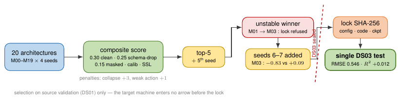

# Protocol

How the cross-machine result was produced, and what was done to keep the target machine out
of every decision that shaped the model. This page describes the audited protocol; the
numbers it produced are in [results.md](results.md), the data it consumes in
[data.md](data.md), and the commands that run it in [reproduce.md](reproduce.md).

- **Source (DS01)** — THWS five-axis CNC milling dataset, 62 NC-program sessions, 17 canonical
  sensor channels, evaluated on a 1 Hz grid.
- **Target (DS03)** — FH JOANNEUM CNC machining repository, 7 independent runs, exposing 10 of
  those 17 channels.
- **Task** — context `K = 32 s`, direct multi-horizon prediction at `{1, 2, 4, 8, 16} s`.
  Direct, not autoregressive: the predictor emits one latent per horizon from the same context.
- **Actions** — spindle speed and the commanded X/Y/Z feeds.

---

## 1. Splits

Source sessions are split **group-disjoint on `session_id`** (`protocol.group_split_key`), so
no window can straddle two splits and no session contributes rows to more than one split. The
split is deterministic in `cfg.seed`, not random per run.

| Split | Sessions | Windows |
|---|---|---|
| `source_train` | 42 | 18,267 |
| `source_val` | 11 | 3,423 |
| `source_test` | 9 | 5,189 |

Target windows are never split: the 7 DS03 runs form one held-out set of **2,457 windows** on
the 10 shared channels. `scripts/02_build_protocol_splits.py` materialises the split;
`scripts/05_window_leakage_audit.py` verifies that no window index appears in two splits and
that windows never cross a session boundary.

## 2. Normalizers

`normalization.mode: source_zscore`, fitted by `scripts/04_fit_normalizers.py` on
`source_train` only, with `protocol.strict_train_only_normalization: true`. The same fixed
statistics are applied to source validation, source test and the target machine — the target
is normalised with source statistics it never contributed to.

`scripts/08_normalization_leakage_audit.py` re-fits the normalizer on each split in turn and
reports the divergence, so a normalizer that had silently seen validation or target rows shows
up as a mismatch rather than as a quietly better score.

All reported RMSE values are in these z units unless stated otherwise. Architecture-search
metrics are additionally mapped into one **fixed reference space** — the canonical
`source_zscore` fit on `source_train` — before any RMSE is computed
(`scripts/_val_bundle.py`, `Normalizer.affine_to`), so candidates that normalise differently
are still commensurable. For `source_zscore` candidates that map is the identity bitwise.

## 3. Deterministic validation masks

Training masks are redrawn every epoch; validation masks are seeded per window index
(`WindowDataset(mask_rng_seed=...)`), so the same validation window is masked identically on
every evaluation and across every candidate. `tests/test_p3fix.py` section (b) asserts both
halves of this: seeded validation masks reproduce bit for bit, and training masks do vary
across epochs.

## 4. The P3-FIX gate

An earlier iteration of the pipeline produced a JEPA that looked trained and was not. Two
faults compounded. First, the VICReg variance–covariance term was applied to the predictor
outputs only, leaving the EMA target latents unregularised; the target encoder collapsed to an
**effective rank of roughly 5 % of the latent dimensionality**, so the latent loss was being
minimised against an almost constant target. Second, the physical mean/log-variance head was
never trained during pure SSL, so evaluating a pretrained checkpoint directly measured a head
that emits a constant (`mu_std ≈ 0` against the target's own spread — the diagnostic signature
script 62 calls the P3 symptom). The fix moves the regularisers to the right latents
(`jepa.vicreg_placement: context_target`, which raised target-encoder effective rank to about
**58 %**), forces `jepa.physical_weight = 0` during pure SSL so no gradient reaches the head,
selects the pretraining checkpoint on a **held-out SSL objective** rather than training loss,
and makes `--head fresh` the default fine-tuning path so the pretraining comparison is not
confounded by a head that was never trained on the forecasting objective.

The gate has three jobs and it aborts the whole run when any of them fails:

| Job | What it does |
|---|---|
| `scripts/62_p3fix_diagnostics.py` | Checkpoint load audit (missing/unexpected keys, a `weights_changed` proof), the mean-spread probe, and latent health (std, off-diagonal correlation, effective rank, collapse flag) on `source_val`. Never reads DS03. |
| `scripts/63_p3fix_abc_seeds.py` | The A/B/C experiment over matched seeds: **A** scratch, **B** pretrained body + reinitialised head (primary), **C** full pretrained checkpoint including the head (contamination control). Same data, loaders, seed and epoch budget; persistence and linear drift are scored on the identical split. If no arm beats the trivial references, the forecasting formulation is the problem and no transfer claim is admissible. |
| `tests/test_p3fix.py` | Regression tests for the invariants: (a) split leakage, (b) mask determinism, (c) EMA momentum and schedule, (d) target-encoder detachment and zero gradient, (e) metric aggregation against hand-computed values, (f) checkpoint audit, and (i) the RevIN equivariance and round-trip invariants added post-lock. |

The A/B/C answer was negative, and it is reported as such: JEPA pretraining gives no clean-source
forecasting gain over matched scratch training (0.811 ± 0.022 vs 0.813 ± 0.022, p = 0.76).

## 5. The validation-only selection score

Ranking never touches the target machine. `scripts/_search_common.py` defines a single
composite, every term lower-is-better, standardised across the candidate pool currently being
ranked:

```
composite = 0.30*z(clean_rmse)
          + 0.25*z(schema_drop_rmse)
          + 0.15*z(masked_rmse)
          + 0.10*z(long_horizon_rmse)
          + 0.10*z(calibration_penalty)
          + 0.10*z(ssl_latent_val)
          + 3.0*collapse_flag
          + 1.0*weak_action_flag
```

`z` is taken per component over the valid candidate-seed rows of that pool (`(x - mean)/std`,
`ddof = 0`; a zero-variance component contributes 0). The two penalties are the important part:
**3.0 per collapsed seed** and **1.0 for weak action usage** dominate any plausible RMSE
difference, so a candidate that wins on RMSE by collapsing its latent space, or by ignoring the
control input, cannot win the search.

Because the z-statistics are recomputed inside whichever pool is being ranked, discovery
composites (20 candidates) and confirmation composites (top-5) are **not comparable in absolute
value** — only their orderings are. Runs that script 41 marks invalid (NaN metric,
checkpoint-load failure, SSL latent collapse, deterministic-validation failure) are excluded
from the z-statistics and from the ranking, and reported separately.

## 6. The search, and the refused lock

<p align="center">
  
</p>

The 20 candidates in `configs/search_v2/M00..M19.yaml` were written down before any of them
ran. They vary mask type and ratio, action injection, encoder norm, latent LayerNorm, VICReg
mode and weight, latent weight, horizon aggregation, schema consistency, action recovery, EMA
schedule, model scale and source normalizer.

1. **Discovery** — 20 candidates × 4 seeds, source data only (`scripts/42`, driven from
   `configs/search_v2/manifest.json`). Two candidates collapsed outright: the plain JEPA
   control without anti-collapse regularisation on all four seeds, and the largest model
   (`d = 512`, eight layers) on three of four.
2. **Rank** — `scripts/43_rank_methods_validation_only.py`, on the composite above.
3. **Confirm** — `scripts/64_confirm_top5.py` adds a fifth seed to the top five and re-ranks
   inside that pool. **The provisional winner changed.** The four-seed discovery leader
   (per-horizon VICReg) fell to second; the schema-consistency plus action-recovery variant
   rose to first.
4. **Refuse to lock** — because the leader moved under confirmation, locking was refused and
   seeds 5 and 6 were added (the second `scripts/64` invocation). After seven seeds the order
   was stable: schema + action recovery at composite −0.83, per-horizon VICReg at +0.09, and
   the winner's source-validation RMSE settled at **0.822 ± 0.009**.
5. **Lock** — `scripts/44_lock_best_method.py` writes a SHA-256 lock over the configuration,
   the code, the normalizer and the checkpoint. That candidate is **M03**
   (`configs/search_v2/M03.yaml`).
6. **Read the target, once** — `scripts/45_test_locked_method_ds03.py` runs only after the lock
   file exists.

`scripts/55_triple_review.py` enforces the blindness mechanically: any occurrence of the string
`target_all` in `scripts/41`, `scripts/43`, `scripts/44`, `scripts/64` or
`scripts/_search_common.py` fails the build.

## 7. The second DS03 read

DS03 has been opened exactly twice. The second opening was declared before it ran, conditioned
on a validation verdict that was fixed first, and it is recorded verbatim in the artifact
(`paper/results/revin_ablation/ds03_test.json`, field `declaration`):

> DS03 (target machine) re-opened on 2026-09-09 for the paired RevIN ablation (V2). V1 lock
> (outputs/random_search/LOCKED_BEST.json) already consumed the single declared test; this is
> the second, declared, opening. Both arms are evaluated on every seed with no selection on
> DS03; the validation verdict (summary.json) was fixed before this stage ran.

Both arms — M03 and M03 + RevIN — were evaluated on all three seeds through the same
`scripts/45` protocol, with the model rebuilt from each run's own `config.yaml` and the
`source_train` normalizers. Nothing was selected on the target. See
[results.md](results.md#post-lock-revin-ablation-paper-app-h).

## 8. Baselines: what is official and what is not

Two families of baselines exist in this repository and they carry different weight.

**In-house approximations — `scripts/22` to `scripts/26`.** SimMTM-, PatchFormer-, EMIT-,
MMR- and LoMaR-inspired reconstruction baselines, written here for controlled ablation under an
identical protocol. They are **not** reproductions of the published methods and must be called
`-style` or `-inspired` wherever they appear. The same caveat applies to `PatchTSTLike` and
`ITransformerLike` inside `scripts/20`'s supervised sweep.

**Official repositories — `scripts/66_run_official_baselines.py`.** The comparison numbers come
from the authors' own code, pinned to a commit in `third_party/README.md` (PatchTST
`204c21ef`, iTransformer `c2426e68`, SimMTM `169513be`), driven through the repos' own run
scripts. Exactly two things are substituted: the dataset class
(`third_party/cnc_adapter/cnc_dataset.py`, which windows per session, never across, and applies
`outputs/normalizers.json` instead of refitting its own scaler) and the evaluation, which scores
the same horizons in the same z units as the rest of the protocol. `scripts/29` exports the
identical splits and windows those repos consume, so the baselines provably see the same data.

## 9. Research positioning and forbidden claims

Carried over from the pre-experiment positioning note
([docs/internal/NOVELTY_GAP.md](internal/NOVELTY_GAP.md)), which was written before any of these
runs and still governs what may be said.

**What is not novel enough.** JEPA for time series or sensor streams alone is not a defensible
contribution; the territory is covered. Masked reconstruction is a strong alternative, including
SimMTM-, EMIT- and PatchFormer-style approaches.

**The narrower hypothesis actually tested.** Can an action-conditioned JEPA learn cross-machine
industrial dynamics when the target machine exposes only a partially overlapping sensor schema,
and can the learned latent retain action sensitivity while adapting from few target runs?

**Claims that must not be made.**

- Do not claim state of the art from the architecture search alone.
- Do not call the SimMTM/PatchFormer/EMIT/MMR/LoMaR-inspired code an official reproduction.
- Do not claim the one-source/one-target scale limitation is solved — it is only audited more
  carefully.
- Do not select a method after observing DS03 test metrics.

**Decision rule.** Search on source validation only (`scripts/40`–`44`). Lock the winning method
and its checkpoint hash. Only then run `scripts/45` once on DS03. Compare against official or
carefully reproduced baselines under the same split and preprocessing before any SOTA claim.

The paper makes no SOTA claim.

---

## What this does not show

- **One source machine and one target machine.** Seven independent target runs support a
  careful case study, not a claim about cross-machine invariance in general. No amount of
  architecture search changes that; more machines or an external dataset would.
- **The locked target number is a single checkpoint, evaluated once.** 0.546 is one sealed pass
  of one configuration. The three-seed control arm of the post-lock ablation, run later on the
  same target windows, gives 0.555 ± 0.015 — the spread you should have in mind around a single
  pass.
- **Statistical power on the target is weak by construction.** Seven runs; run-level paired
  tests (`scripts/39`) cannot resolve small differences, and `scripts/09` quantifies how weak.
  The post-lock ablation has three paired seeds, where the exact sign-flip test cannot go below
  p = 0.125 — read the bootstrap intervals and the per-seed wins, not the p-values.
- **The model does not beat the official forecasters on raw zero-shot RMSE.** PatchTST 0.503 and
  iTransformer 0.498 against 0.546. The post-lock ablation attributes the gap to instance
  normalisation rather than to architecture, and closing it costs target calibration.
- **Several diagnostics were measured on the pre-lock model and have not been re-measured on the
  locked one**: the few-shot adaptation curve, the action-shuffle sensitivity (which moved target
  RMSE by less than 0.005), and interval coverage (67 % empirical at a nominal 90 %). They are
  reported as diagnostics, not as confirmatory results.
- **Ablations and baselines are single-seed** at repository defaults, apart from the runs where a
  seed count is stated explicitly.
- **Planning is demonstrated, not validated.** `scripts/38` runs CEM against the learned model;
  no closed-loop result on a real machine is claimed.
